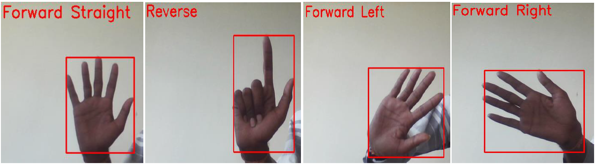
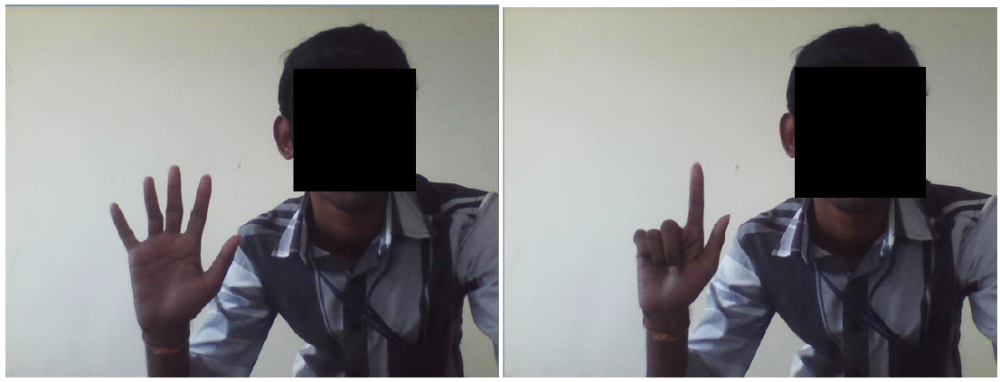
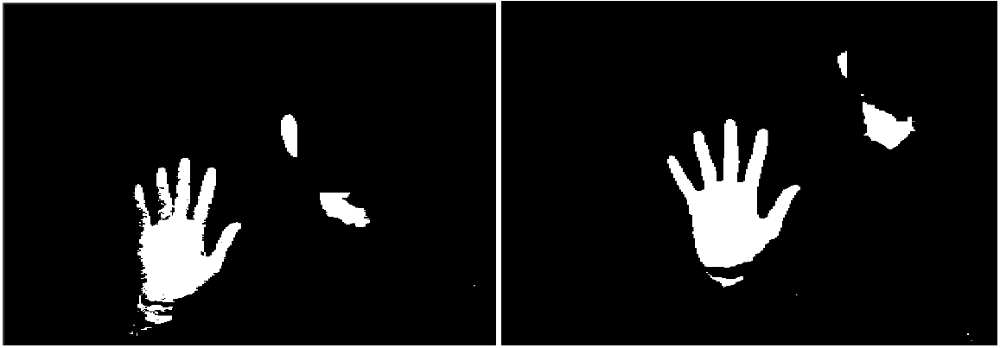
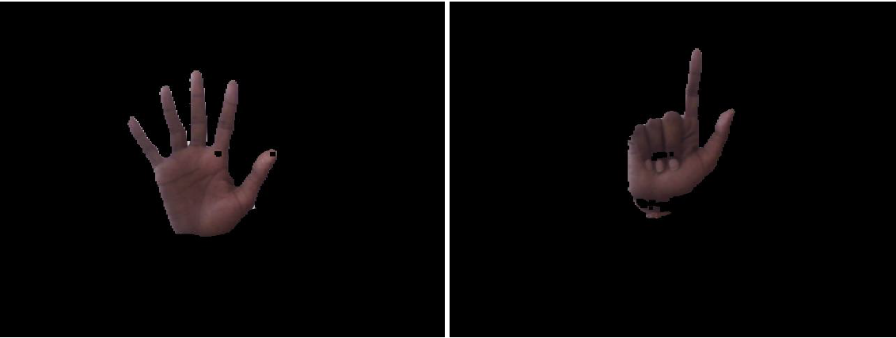
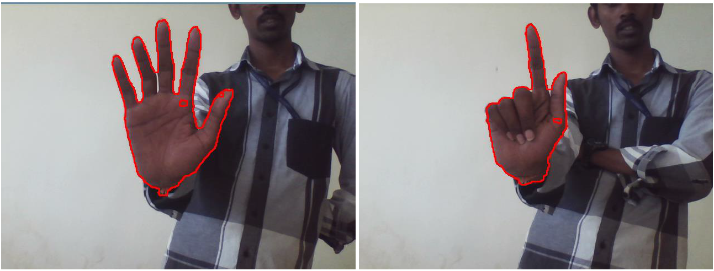
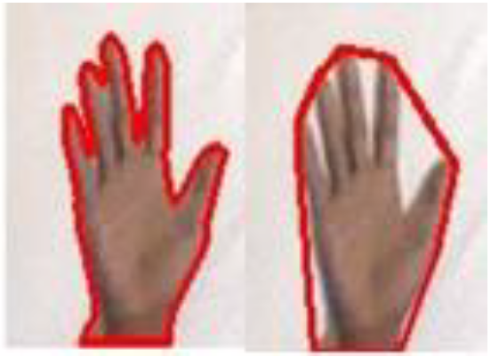
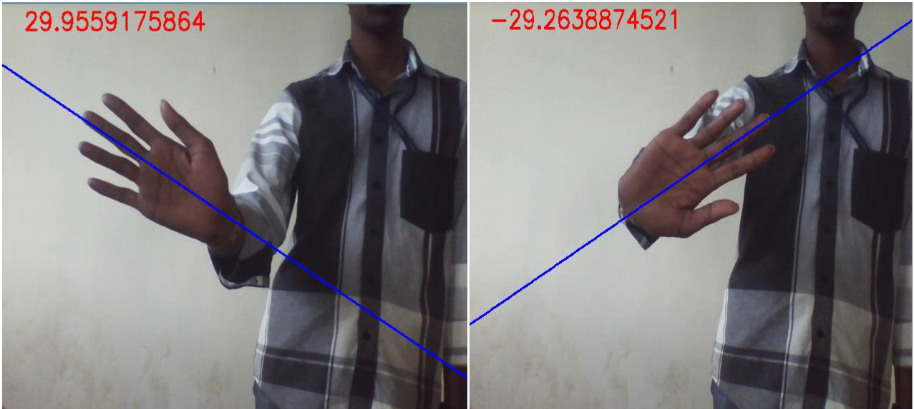

# Hand-Gesture-Recognition

With the development of technology, computers are playing crucial role in our day-to-day life. Like humanity, computers are also progressing through various revolutions. Current generation computers are so advanced that the traditional user interaction devices like keyboard and mouse do not meet the challenges in many cases like Human-Robot interaction. So, there is a need to revolutionize the interactivity of humans with computers. One of the best solutions is the use of human hands as the input device. Because of the vast degree of freedom, it provides natural interaction with computers. A gesture recognition is a field with the goal of interpreting human gestures via mathematical algorithm and it is a way that the computers to begin to understand human body language. This technology has various applications, both in commercial and industrial fields.

In this project, we propose a vision based control system using hand gestures captured from the camera. The system allows the user to give various commands such as start, stop, moving forward, etc. remotely to an external automobile unit using simple hand gestures. It recognizes up to four different hand gestures which are interpreted as commands for driving the automobile unit. The reliability and efficiency of this application depend on the illumination conditions and background

There are three stages in our system. In the first stage, dataset of the desired hand gestures is captured in a uniform environment and they are used to train the Support Vector Machine (SVM) classifier. The second stage captures the real time video feed from the webcam on the computer, preprocesses every frame to get the region of interest and finally recognizes the hand posture by the trained SVM classifier. In the final stage, the recognized hand postures are converted to suitable commands and are transmitted to a remote device to control the automobile unit.

### Recognition

### Face Subtraction

### yCbCr Color Space
Converted the image to yCbCr color space to detect the skin color properly

### contour Detection

### Feature Extraction
    - No. of defect Points - Defect points are the farthest points between two Hull points, which are the points present in the outer layer of the contour
    - Auxilary ratio - Width to height ratio of the bounding rectangle, which is the minimum area rectangle covering the contour.
    - contour area to bounding box area - Ratio of area of the bounding rectangle and area covered by the contour.
    - HULL area - Ratio of area of the bounding rectangle and area covered by the hull of the contour.
    - Solidity - Ratio of area covered by the contour and hull area
    - Hu-Moments - Hu-moments are the scale and rotational invariant parameters of a shape described using the image moments

    **Feature Vector Table for two different Hand Gestures**

    |       | No. of Defects | Auxilary Ratio | Contour area ratio | Hull Area ratio | Solidity |
    | ----- | -------------- | -------------- | ------------------ | --------------- | -------- |
    | Palm | 4 | 0.972 | 2.04 | 1.43 | 0.68 |
    | One | 2 | 0.58 | 1.95 | 1.6 | 0.817 |

    **Hu-Moments of the hand region for two different hand posture**

    |       | HM1 | HM2 | HM3 | HM4 | HM5 | HM6 | HM7 |
    | ----- | --- | --- | --- | --- | --- | --- | --- |
    | Palm | 0.000994 | 6.02E-08 | 2.33E-10 | 2.49E-10 | 5.7E-20 | 5.56E-14 | 1.91E-20 |
    | One | 0.00087 | 0.00000023 | 1.66E-10 | 4.11E-11 | 3.25E-21 | 1.17E-14 | -1.05E-21 |

### Closing Operation

### Hull Region

### Orientation

